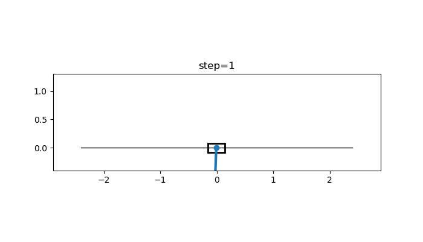

# Inverted Double Pendulum RL

This repository simulates an inverted double pendulum on a cart and trains controllers to swing up, capture, and balance the links upright.

The project includes:

- A derived dynamics model for a cart-constrained double pendulum
- RK4 time integration with Earth gravity
- A Gymnasium-compatible environment
- PyTorch PPO training and evaluation
- Hybrid control experiments that combine RL, MPC-style capture, and LQR stabilization
- Checkpoint, metrics, rollout, animation, and config snapshot outputs

## System In Action



## Quick Start

Create a virtual environment and install the project:

```powershell
python -m venv .venv
.\.venv\Scripts\Activate.ps1
python -m pip install -e .[dev]
```

Run a short smoke training job:

```powershell
idp-train --config configs/default.yaml --run-dir runs/smoke --total-steps 2048 --rollout-steps 256
```

Evaluate a trained checkpoint:

```powershell
idp-evaluate --config configs/default.yaml --checkpoint runs/balance_v1/checkpoints/latest.pt --episodes 3 --render
```

Run the test suite:

```powershell
python -m pytest
```

Tests that need Gymnasium or PyTorch are skipped when those optional runtime packages are not installed.

## Docker

Build a CPU-only image:

```powershell
docker build -t inverted-double-pendulum-rl .
```

Run the default container command. This performs a short smoke training run:

```powershell
docker run --rm -v "${PWD}/runs:/app/runs" inverted-double-pendulum-rl
```

Run any project CLI command by overriding the container command:

```powershell
docker run --rm -v "${PWD}/runs:/app/runs" inverted-double-pendulum-rl idp-train --config configs/swingup.yaml --run-dir runs/swingup_v1 --device cpu
docker run --rm -v "${PWD}/runs:/app/runs" inverted-double-pendulum-rl idp-evaluate --config configs/swingup.yaml --run-dir runs/swingup_v1 --episodes 1 --device cpu --save-animation runs/swingup_v1/animation.gif
```

The image uses a headless Matplotlib backend, so saving animations works inside Docker. Interactive `--render` windows usually need extra host display setup; prefer `--save-animation` for portable runs.

## Project Layout

```text
configs/     Training and controller configuration files
src/idp_rl/  Dynamics, environments, PPO, controllers, and CLI entry points
tests/       Unit and behavior tests
runs/        Local training outputs, checkpoints, metrics, and animations
```

## Common Workflows

### Balance From Near Upright

Train a PPO controller for the default balancing task:

```powershell
idp-train --config configs/default.yaml --run-dir runs/balance_v1 --total-steps 200000
```

Evaluate the saved checkpoint:

```powershell
idp-evaluate --config configs/default.yaml --checkpoint runs/balance_v1/checkpoints/latest.pt --episodes 3 --render
```

### Swing Up From Hanging

Train a swing-up policy:

```powershell
idp-train --config configs/swingup.yaml --run-dir runs/swingup_v1 --device auto
```

Evaluate the latest checkpoint and save a GIF:

```powershell
idp-evaluate --config configs/swingup.yaml --run-dir runs/swingup_v1 --episodes 1 --device auto --save-animation runs/swingup_v1/animation.gif
```

### Curriculum Swing-Up

Run curriculum swing-up training with vectorized PPO:

```powershell
idp-train --config configs/swingup_curriculum.yaml --run-dir runs/swingup_curriculum --device auto --max-train-seconds 1800
```

Evaluate either the latest checkpoint or the best checkpoint:

```powershell
idp-evaluate --config configs/swingup_curriculum.yaml --run-dir runs/swingup_curriculum --episodes 10 --device auto --save-animation runs/swingup_curriculum/latest.gif
idp-evaluate --config configs/swingup_curriculum.yaml --checkpoint runs/swingup_curriculum/checkpoints/best.pt --episodes 10 --device auto --save-animation runs/swingup_curriculum/best.gif
```

## Two-Stage Controllers

The swing-up policy can reach near-vertical states, but it may pass through them too quickly to satisfy the hold criterion. Two-stage runners address this by using one controller for energy building and a second controller for capture and stabilization.

### PPO Swing-Up Plus PPO Stabilizer

Train a stabilizer from near-upright states:

```powershell
idp-train --config configs/stabilizer.yaml --run-dir runs/stabilizer --device auto --max-train-seconds 1200
```

Evaluate the stabilizer:

```powershell
idp-evaluate --config configs/stabilizer.yaml --run-dir runs/stabilizer --episodes 10 --device auto --save-animation runs/stabilizer/latest.gif
```

Run the two-stage agent:

```powershell
idp-agent --swingup-config configs/swingup_curriculum.yaml --swingup-checkpoint runs/swingup_curriculum/checkpoints/latest.pt --stabilizer-config configs/stabilizer.yaml --stabilizer-checkpoint runs/stabilizer/checkpoints/latest.pt --episodes 10 --device auto --save-animation runs/two_stage/latest.gif
```

### LQR-Warm-Started Stabilizer

This workflow numerically linearizes the dynamics around upright, solves a continuous-time Riccati equation, and trains the neural actor to imitate the local LQR controller before PPO fine-tuning.

Pretrain the stabilizer:

```powershell
idp-pretrain-stabilizer --config configs/stabilizer_lqr.yaml --run-dir runs/stabilizer_lqr --samples 200000 --epochs 20 --batch-size 2048 --device auto
```

Evaluate the pretrained policy:

```powershell
idp-evaluate --config configs/stabilizer_lqr.yaml --run-dir runs/stabilizer_lqr --episodes 10 --device auto --save-animation runs/stabilizer_lqr/pretrained.gif
```

Fine-tune with PPO:

```powershell
idp-train --config configs/stabilizer_lqr.yaml --run-dir runs/stabilizer_lqr_finetune --device auto --max-train-seconds 2400 --resume-checkpoint runs/stabilizer_lqr/checkpoints/latest.pt
```

Run the LQR-warm-started two-stage agent:

```powershell
idp-agent --swingup-config configs/swingup_curriculum.yaml --swingup-checkpoint runs/swingup_curriculum/checkpoints/latest.pt --stabilizer-config configs/stabilizer_lqr.yaml --stabilizer-checkpoint runs/stabilizer_lqr_finetune/checkpoints/latest.pt --episodes 10 --device auto --save-animation runs/two_stage_lqr/latest.gif
```

## Hybrid Controllers

Hybrid runners keep the learned RL swing-up policy for energy building, then use model-based capture and local stabilization to target the main failure mode: fast near-vertical fly-throughs that a single neural policy may not reliably catch.

### RL Swing-Up Plus MPC Capture Plus LQR

```powershell
idp-hybrid-agent --swingup-config configs/swingup_reliability.yaml --swingup-checkpoint runs/swingup_reliability/checkpoints/best_two_stage.pt --config configs/hybrid_reliable.yaml --episodes 10 --device auto --save-animation runs/hybrid_reliable/latest.gif
```

### Fixed-Seed Portfolio Controller

Portfolio mode scores several saved swing-up policies at episode start with the known simulator model, then runs the predicted-best policy through the same MPC/LQR hybrid stack. It keeps the 20 N force limit while covering fixed seeds solved by different PPO checkpoints.

```powershell
idp-hybrid-agent --swingup-config configs/swingup_reliability.yaml --swingup-checkpoints runs/swingup_reliability/checkpoints/best_two_stage.pt runs/swingup_reliability/checkpoints/step_102400.pt runs/swingup_reliability/checkpoints/step_327680.pt runs/swingup_reliability/checkpoints/step_81920.pt runs/swingup_reliability/checkpoints/step_1003520.pt --config configs/hybrid_10of10.yaml --episodes 10 --device auto --save-animation runs/hybrid_10of10/latest.gif
```

## Runtime Notes

`--device auto` uses CUDA when `torch.cuda.is_available()` is true. Otherwise, it falls back to CPU.

If your environment installed a CPU-only PyTorch build, install a CUDA-enabled PyTorch wheel separately before running GPU training.

Training and evaluation commands write outputs under the chosen `--run-dir`, including checkpoints, metrics, rollout data, animations, and copied config files.
